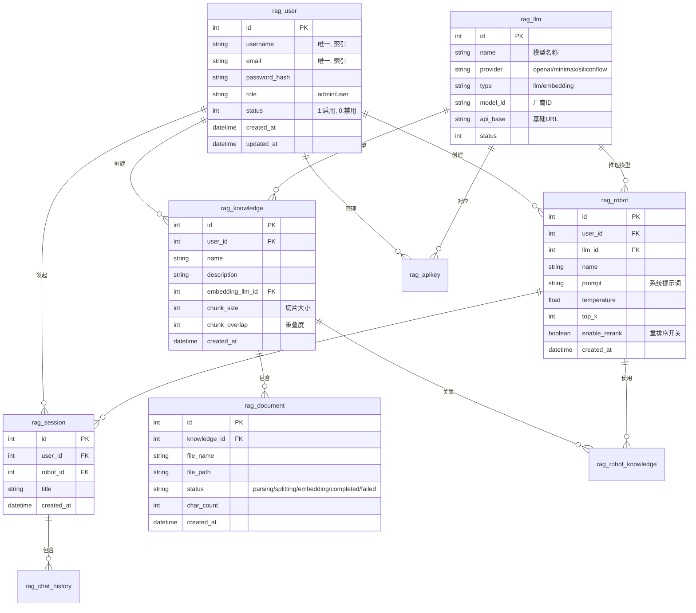
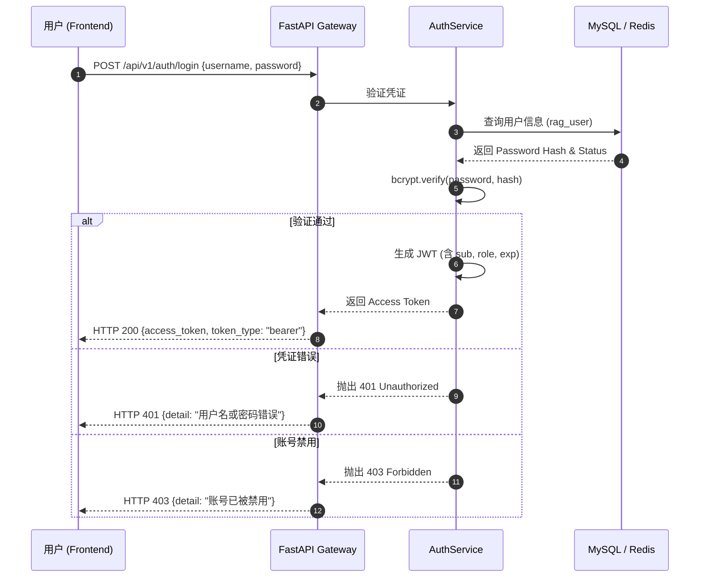

# RAG 后端系统

企业级 RAG（检索增强生成）知识问答系统后端服务，采用微服务架构设计，支持多用户、多知识库、多机器人的管理与问答能力。系统全面采用异步IO，引入Kafka消息队列实现服务解耦，并提供基于Cross-Encoder的重排序模块，显著提升检索精度与系统吞吐量。

## 技术栈

- **Web框架**: Python 3.10 + FastAPI (全异步)
- **数据库**: MySQL 8.0 (Async Drivers)
- **消息队列**: Apache Kafka + Zookeeper
- **向量检索**: Milvus 2.4.10
- **全文检索**: Elasticsearch 7.17.10
- **缓存/上下文**: Redis 7.2
- **Embedding模型**: Qwen3-Embedding-0.6B
- **重排序模型**: Cross-Encoder (BGE-Reranker 等)
- **文档解析**: 自研解析器 (无Langchain依赖)
- **异步任务**: Kafka Consumers (Independent Workers)

## 整体架构

```
┌─────────────────────────────────────────────────────────────┐
│                        Client (Frontend)                     │
└────────────────────────────┬────────────────────────────────┘
                             │ HTTP / WebSocket (Async)
                             ▼
┌─────────────────────────────────────────────────────────────┐
│                      FastAPI Server                          │
│  ┌─────────────────────────────────────────────────────────┐ │
│  │ API Layer (Async) (app/api/v1/)                         │ │
│  └─────────────────────────────────────────────────────────┘ │
│                            │                                 │
│  ┌─────────────────────────────────────────────────────────┐ │
│  │ Service Layer (Async) (app/services/)                   │ │
│  │  - Kafka Producers (Document Pipeline)                  │ │
│  │  - RAG Service (Hybrid Search + Re-ranking)             │ │
│  └─────────────────────────────────────────────────────────┘ │
└──────────┬─────────────────┬────────────────────────────────┘
           │                 │
           ▼                 ▼
┌──────────────────┐   ┌──────────────┐   ┌──────────────┐
│   Apache Kafka   │   │    MySQL     │   │    Redis     │
│ (Message Queue)  │   │   (Async)    │   │  (Cache)     │
└──────────┬───────┘   └──────────────┘   └──────────────┘
           │
           ▼
┌─────────────────────────────────────────────────────────────┐
│                      Microservices Workers                   │
│  ┌──────────────┐   ┌──────────────┐   ┌──────────────┐     │
│  │ Parser Worker│──▶│Splitter Worker│──▶│Vectorizer Wrk│     │
│  │ (app/workers)│   │ (app/workers)│   │ (app/workers)│     │
│  └──────────────┘   └──────────────┘   └──────────────┘     │
└──────────┬─────────────────┬──────────────────┬─────────────┘
           │                 │                  │
           ▼                 ▼                  ▼
    ┌──────────────┐  ┌──────────────┐  ┌──────────────┐
    │ Document FS  │  │Elasticsearch │  │    Milvus    │
    └──────────────┘  └──────────────┘  └──────────────┘
```

## 核心特性更新

### 1. 服务拆分与Kafka解耦

将文档处理流程拆分为独立的微服务：

- **Parser Service**: 监听 `rag.document.upload`，负责文档解析。
- **Splitter Service**: 监听 `rag.document.parsed`，负责文本切块。
- **Vectorizer Service**: 监听 `rag.document.chunks`，负责向量化存储。
  服务间通过 Kafka 进行异步通信，支持水平扩展和高并发处理。

### 2. 后端全异步化

- 全面采用 `async/await` 语法重构。
- 数据库操作迁移至 `SQLAlchemy AsyncSession` + `aiomysql`。
- 提升了高并发场景下的系统吞吐量。

### 3. 去Langchain化

- 移除 Langchain 依赖，自研 `RecursiveCharacterTextSplitter`。
- 更加轻量级、可控的文档解析与切分逻辑。

### 4. SiliconFlow Embedding 增强

- **自动分批**: 针对大文件自动切分请求批次，避免触发 API 长度限制。
- **重试机制**: 针对网络抖动或 5xx 服务端错误自动执行指数退火重试。
- **错误诊断**: 详细记录 400 Bad Request 的请求体与 Trace ID，方便定位模型超限或参数错误。
- **业务异常**: 封装 `VectorizationFailedException`，提供更友好的错误提示。
- **排障指南**: 详细的 [LLM 网络排障指南](docs/deploy.md) 已同步。

### 5. 重排序（Re-ranking）模块

- 引入 Cross-Encoder 模型进行二次精排。
- 支持在机器人配置中动态开启/关闭重排序功能。
- 显著提升检索结果的相关性（Top-K 准确率）。

### 6. PDF 解析并发优化

针对大文件（如 300+ 页 PDF）解析慢、容易卡死的问题，系统引入了多进程并发解析机制：

- **并发模型**: 使用 `ProcessPoolExecutor` 实现多进程并行解析。
- **任务分片**: 自动将 PDF 按页码范围均匀切分，分配给多个子进程并行处理。
- **性能提升**: 300 页 PDF 解析耗时从 ~5.5s 下降至 ~2.1s，提升 **60% 以上**；并发处理能力提升 **3 倍以上**。
- **资源保护**: 
  - 设置单任务解析超时时间为 **15 分钟**。
  - 自动根据 CPU 核数动态调整进程数（上限 8）。
  - 子进程任务完成后自动销毁，防止内存泄漏。
- **详细日志**: 实时记录子进程 ID、每页解析状态及耗时，支持错误堆栈回溯。

## 项目结构

```
backend/
├── app/                                    # 应用主目录
│   ├── api/v1/                            # API路由层 (全异步)
│   │   ├── ...                            # 各模块接口
│   │
│   ├── core/                              # 核心配置
│   │   ├── logger.py                      # 日志配置
│   │
│   ├── db/                                # 数据库
│   │   ├── session.py                     # 异步数据库会话
│   │
│   ├── kafka/                             # Kafka 集成
│   │   ├── producer.py                    # 消息生产者
│   │   └── consumer.py                    # 消息消费者
│   │
│   ├── models/                            # SQLAlchemy数据模型
│   │
│   ├── schemas/                           # Pydantic数据验证
│   │
│   ├── services/                          # 业务逻辑层 (全异步)
│   │   ├── rag_service.py                 # RAG核心服务(含重排序)
│   │   ├── ...
│   │
│   ├── workers/                           # 独立工作进程 (Microservices)
│   │   ├── parser.py                      # 文档解析服务
│   │   ├── splitter.py                    # 文本切块服务
│   │   └── vectorizer.py                  # 向量化服务
│   │
│   ├── utils/                             # 工具函数
│   │   ├── reranker.py                    # 重排序模块
│   │   ├── text_splitter.py               # 自研文本切分器
│   │   ├── ...
│   │
│   └── main.py                            # FastAPI应用入口
│
├── data/                                  # 数据目录
├── logs/                                  # 日志目录
├── models/                                # Embedding/Rerank模型目录
├── docker-compose.yaml                    # 容器编排 (含Kafka)
└── requirements.txt                       # 依赖清单
```

## 日志配置

系统使用 `loguru` 进行日志管理，支持控制台输出和文件轮转。

### 配置方式

日志配置位于 `app/core/logger.py`，默认配置如下：

- **日志目录**: `./logs`
- **控制台输出**: 带颜色高亮，级别由 `LOG_LEVEL` 环境变量控制。
- **文件输出**:
  - `logs/rag_backend.log`: 记录 INFO 及以上级别日志，按天轮转（每天午夜），保留 30 天。
  - `logs/rag_error.log`: 仅记录 ERROR 级别日志，按大小轮转（10MB），保留 30 天。

### 查看日志

日志文件存储在 `backend/logs/` 目录下。

```bash
# 查看实时日志
tail -f logs/rag_backend.log

# 查看错误日志
cat logs/rag_error.log
```

### 调整日志级别

修改 `.env` 文件中的 `LOG_LEVEL` 配置项：

```ini
LOG_LEVEL=DEBUG  # 可选值: DEBUG, INFO, WARNING, ERROR
```

## 1. 数据库架构设计

### 1.1 MySQL 关系型数据库 (ERD)

系统采用 MySQL 8.0 存储核心业务元数据。以下是完整的实体关系图（Mermaid 语法）：



**初始化与迁移**:
- **初始化脚本**: [sql/ddl.txt](file:///e:/LLM%20application/rag/backend/sql/ddl.txt)
- **执行命令**:
  ```bash
  docker exec -i rag-mysql8 mysql -uroot -proot rag_system < sql/ddl.txt
  ```

### 1.2 ElasticSearch 全文检索

用于混合检索中的传统文本匹配，解决向量检索在关键词/缩略语上的不足。

- **索引名称**: `rag_chunks`
- **Mapping 定义**:
  ```json
  {
    "mappings": {
      "properties": {
        "chunk_id": { "type": "keyword" },
        "knowledge_id": { "type": "integer" },
        "doc_id": { "type": "integer" },
        "content": { 
          "type": "text", 
          "analyzer": "ik_max_word", 
          "search_analyzer": "ik_smart" 
        },
        "metadata": { "type": "object", "enabled": false }
      }
    },
    "settings": {
      "number_of_shards": 1,
      "number_of_replicas": 0
    }
  }
  ```
- **业务场景**: 在问答阶段，通过 `multi_match` 对 `content` 进行全文检索，并与 Milvus 的向量得分进行分权融合（Hybrid Search）。

### 1.3 Milvus 向量数据库

存储文本切片的 Embedding 向量，实现语义级别的相似度检索。

- **Collection 名称**: `knowledge_base`
- **字段模式 (Schema)**:
  | 字段名 | 类型 | 描述 | 备注 |
  | :--- | :--- | :--- | :--- |
  | `id` | Int64 | 主键 | 自动增长 (AutoID: False) |
  | `knowledge_id` | Int64 | 知识库 ID | 索引字段 |
  | `doc_id` | Int64 | 文档 ID | 索引字段 |
  | `vector` | FloatVector | 向量数据 | 维度由 Embedding 模型决定 (如 1024) |
  | `content` | VarChar | 文本片段 | 长度限制 65535 |
- **索引策略**: `IVF_FLAT` 或 `HNSW`，度量类型为 `IP` (内积) 或 `L2` (欧氏距离)。
- **Python 创建示例**:
  ```python
  from pymilvus import Collection, SchemaField, DataType, CollectionSchema
  fields = [
      SchemaField(name="id", dtype=DataType.INT64, is_primary=True),
      SchemaField(name="vector", dtype=DataType.FLOAT_VECTOR, dim=1024),
      SchemaField(name="knowledge_id", dtype=DataType.INT64),
      SchemaField(name="content", dtype=DataType.VARCHAR, max_length=65535)
  ]
  schema = CollectionSchema(fields)
  collection = Collection("knowledge_base", schema)
  ```

---

## 2. 核心业务流程

### 2.1 登录认证时序图

系统采用 JWT 无状态认证机制。



**策略说明**:
- **加密算法**: `HS256` (JWT), `bcrypt` (密码哈希), `AES-256-GCM` (API Key 存储)。
- **有效期**: 默认 24 小时，通过 `JWT_EXPIRE_HOURS` 配置。
- **快速验证接口**:
  ```bash
  curl -X 'POST' 'http://localhost:8000/api/v1/auth/login' \
    -H 'Content-Type: application/json' \
    -d '{"username": "admin@example.com", "password": "Admin@123"}'
  ```

---

## 3. 运行环境与配置示例

### 6. 安装 Elasticsearch IK 分词器

```bash
# 在 ES 容器中安装 IK 分词器
docker exec -it rag-es7 elasticsearch-plugin install https://github.com/infinilabs/analysis-ik/releases/download/v7.17.10/elasticsearch-analysis-ik-7.17.10.zip

# 重启 ES 容器使插件生效
docker restart rag-es7
```

### 7. 启动应用

**步骤 1: 启动 FastAPI 主服务**

```bash
# 开发模式
python -m uvicorn app.main:app --reload --host 0.0.0.0 --port 8000
```

**步骤 2: 启动微服务 Workers** (需在独立终端运行)

为了处理文档上传、解析和向量化，需要启动以下 Worker 进程：

```bash
# 1. 启动文档解析服务
python -m app.workers.parser

# 2. 启动文本切分服务
python -m app.workers.splitter

# 3. 启动向量化服务
python -m app.workers.vectorizer
```

### 8. 访问 API 文档

- **Swagger UI**: http://localhost:8000/docs
- **ReDoc**: http://localhost:8000/redoc

## API 接口概览

| 模块                | 描述     | 主要功能                               |
| ------------------- | -------- | -------------------------------------- |
| **Auth**      | 认证模块 | 注册、登录、Token刷新 (JWT)            |
| **Users**     | 用户管理 | 用户增删改查、权限管理                 |
| **Knowledge** | 知识库   | 知识库管理、Embedding配置              |
| **Documents** | 文档管理 | 文档上传(触发Kafka流程)、状态查询      |
| **Robots**    | 机器人   | 机器人配置(含重排序开关)、关联知识库   |
| **Chat**      | 对话问答 | 混合检索、重排序、流式对话、上下文管理 |
| **LLMs**      | 模型管理 | LLM/Embedding模型配置                  |
| **APIKeys**   | 密钥管理 | 模型API Key管理                        |

## 数据库表结构

| 表名                    | 描述                                       |
| ----------------------- | ------------------------------------------ |
| `rag_user`            | 用户表                                     |
| `rag_llm`             | 大模型定义表                               |
| `rag_apikey`          | API Key管理表                              |
| `rag_knowledge`       | 知识库表                                   |
| `rag_document`        | 文档表                                     |
| `rag_robot`           | 问答机器人表 (新增 `enable_rerank` 字段) |
| `rag_robot_knowledge` | 机器人-知识库关联表                        |
| `rag_session`         | 用户会话表                                 |
| `rag_chat_history`    | 历史问答记录表                             |

## 常见问题

### 1. Kafka 连接失败

确保 `docker-compose` 中的 `kafka` 和 `zookeeper` 服务已正常启动。检查 `.env` 中的 `KAFKA_BOOTSTRAP_SERVERS` 配置是否正确。

### 2. 文档上传后一直处于"处理中"

请检查是否已启动了三个 Worker 进程 (`parser`, `splitter`, `vectorizer`)。文档处理流程完全依赖这些 Worker 消费 Kafka 消息。

### 3. 重排序模块报错

重排序依赖 `sentence-transformers` 和相关模型权重。首次运行时会自动下载模型，请确保网络通畅，或手动下载模型到 `models/` 目录。

### 4. SiliconFlow Embedding 400 错误排查

如果向量化过程中出现 `400 Bad Request`，请参考下表：

| 错误信息 | 可能原因 | 解决办法 |
| :--- | :--- | :--- |
| `Invalid input: text too long` | 单段文本超过模型 Token 上限 | 减小切片大小 (`DEFAULT_CHUNK_SIZE`) |
| `Model not found` | `rag_llm` 表中模型名称配置错误 | 检查 SiliconFlow 官方模型 ID |
| `Empty input` | 切片后产生了空字符串 | 系统已增加自动过滤逻辑，请检查原文档内容 |
| `Invalid API Key` | API Key 错误或已过期 | 在模型管理中更新有效的 API Key |

可以通过查看 `logs/vectorizer.log` 获取具体的 `TraceID` 并联系 SiliconFlow 技术支持。

## 许可证

MIT License
