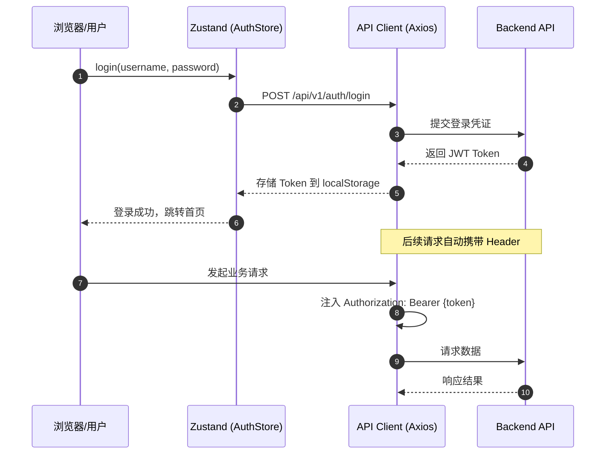
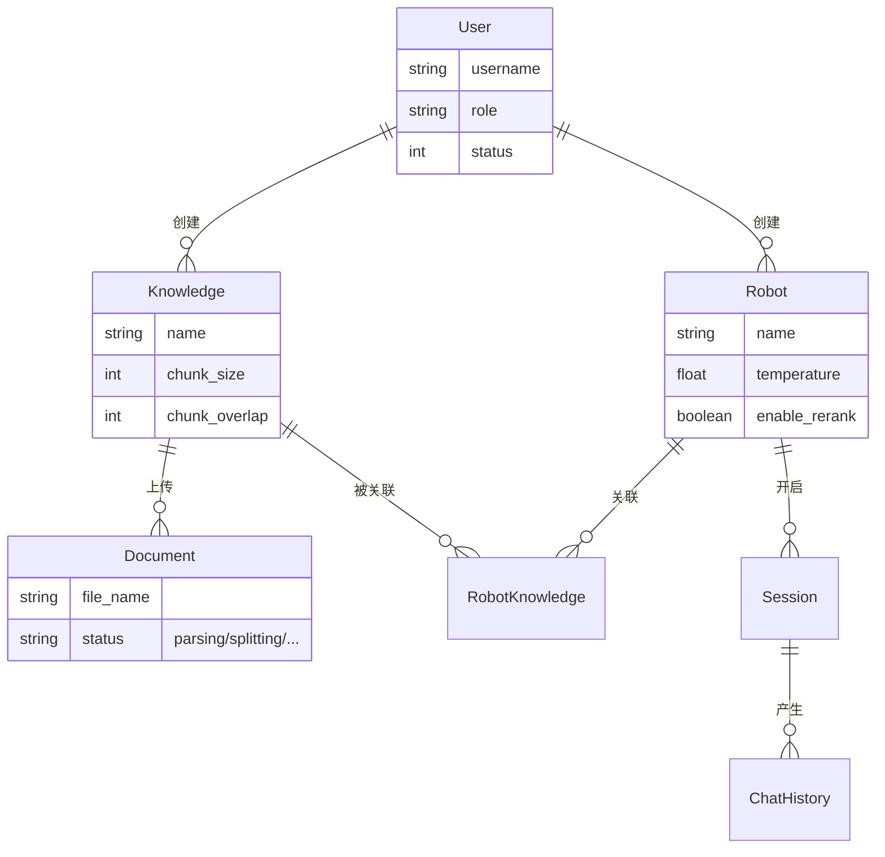

# RAG 前端应用

基于 Next.js 14 构建的 RAG (检索增强生成) 系统前端应用程序，提供完整的知识问答、对话管理和系统配置功能。

## 技术栈

- **框架**: Next.js 14 (App Router)
- **语言**: TypeScript
- **状态管理**: Zustand
- **样式**: Tailwind CSS
- **HTTP 客户端**: Axios
- **图标**: Lucide React
- **通知**: React Hot Toast
- **Markdown**: React Markdown
- **图表**: Recharts

## 整体架构

```
┌─────────────────────────────────────────────────────────────┐
│                     Frontend (Next.js)                       │
│  ┌─────────────────────────────────────────────────────────┐ │
│  │ Pages (src/app/)                                         │ │
│  │  - /auth/login      - /auth/register                     │ │
│  │  - /chat            - /knowledge                        │ │
│  │  - /robots          - /admin/users                       │ │
│  │  - /admin/llms      - /admin/apikeys                    │ │
│  └─────────────────────────────────────────────────────────┘ │
│                            │                                 │
│  ┌─────────────────────────────────────────────────────────┐ │
│  │ Components (src/components/)                             │ │
│  │  - layout/        - ui/          - theme-toggle          │ │
│  └─────────────────────────────────────────────────────────┘ │
│                            │                                 │
│  ┌─────────────────────────────────────────────────────────┐ │
│  │ Stores (Zustand)                                         │ │
│  │  - auth-store    - chat-store    - theme-store          │ │
│  └─────────────────────────────────────────────────────────┘ │
│                            │                                 │
│  ┌─────────────────────────────────────────────────────────┐ │
│  │ API Layer (src/api/)                                     │ │
│  │  - auth, knowledge, document, robot, llm, apikey, chat   │ │
│  └─────────────────────────────────────────────────────────┘ │
└────────────────────────────┬────────────────────────────────┘
                             │ REST API
                             ▼
┌─────────────────────────────────────────────────────────────┐
│                     Backend (FastAPI)                         │
└─────────────────────────────────────────────────────────────┘
```

## 项目结构

```
front/
├── src/
│   ├── api/                      # API 服务层
│   │   ├── auth.ts               # 认证 API (登录/注册/当前用户)
│   │   ├── chat.ts               # 聊天 API (问答/会话/历史)
│   │   ├── document.ts           # 文档 API (上传/列表/删除)
│   │   ├── knowledge.ts          # 知识库 API (CRUD)
│   │   ├── llm.ts                # LLM 模型 API
│   │   ├── apikey.ts             # API 密钥 API
│   │   ├── robot.ts              # 机器人 API
│   │   └── index.ts              # 统一导出
│   │
│   ├── app/                      # Next.js App Router 页面
│   │   ├── admin/                # 管理员面板
│   │   │   ├── apikeys/          # API 密钥管理页面
│   │   │   ├── llms/             # LLM 模型管理页面
│   │   │   ├── page.tsx          # 管理员主页
│   │   │   └── users/            # 用户管理页面
│   │   │
│   │   ├── auth/                 # 认证页面
│   │   │   ├── login/            # 登录页
│   │   │   │   └── page.tsx
│   │   │   └── register/         # 注册页
│   │   │       └── page.tsx
│   │   │
│   │   ├── chat/                 # 聊天对话页面
│   │   │   └── page.tsx          # 聊天主界面
│   │   │
│   │   ├── globals.css           # 全局样式
│   │   ├── knowledge/            # 知识库管理
│   │   │   ├── [id]/             # 知识库详情页
│   │   │   │   └── page.tsx
│   │   │   └── page.tsx          # 知识库列表页
│   │   │
│   │   ├── layout.tsx            # 根布局组件
│   │   ├── page.tsx              # 首页 (自动跳转)
│   │   └── robots/               # 机器人配置页面
│   │       └── page.tsx
│   │
│   ├── components/               # React 组件库
│   │   ├── layout/               # 布局组件
│   │   │   ├── header.tsx        # 页面头部导航
│   │   │   ├── index.ts          # 布局组件导出
│   │   │   └── main-layout.tsx   # 主布局组件
│   │   │
│   │   ├── theme-toggle.tsx      # 主题切换组件
│   │   └── ui/                   # 基础 UI 组件
│   │       ├── button.tsx        # 按钮组件
│   │       ├── card.tsx          # 卡片组件
│   │       ├── form.tsx          # 表单组件
│   │       ├── index.ts          # UI 组件导出
│   │       ├── input.tsx         # 输入框组件
│   │       ├── loading.tsx       # 加载组件
│   │       └── modal.tsx         # 模态框组件
│   │
│   ├── lib/                      # 工具库
│   │   ├── api-client.ts         # Axios HTTP 客户端配置
│   │   └── utils.ts              # 通用工具函数
│   │
│   ├── stores/                   # Zustand 状态管理
│   │   ├── auth-store.ts         # 认证状态
│   │   ├── chat-store.ts         # 聊天状态
│   │   ├── index.ts              # stores 统一导出
│   │   └── theme-store.ts        # 主题状态
│   │
│   └── types/                    # TypeScript 类型定义
│       └── index.ts              # 全部类型定义
│
├── .env.local                    # 环境变量配置
├── next.config.js                # Next.js 配置
├── tailwind.config.ts            # Tailwind CSS 配置
├── tsconfig.json                 # TypeScript 配置
├── package.json                  # 依赖配置
└── Dockerfile                    # Docker 部署配置
```

## 1. 系统认证与安全性

### 1.1 登录流程时序 (Sequnce Diagram)

前端通过 Zustand 状态管理与后端 JWT 认证服务交互。



### 1.2 安全策略
- **Token 存储**: 存储在 `localStorage` 中，并通过 `auth-store.ts` 进行响应式管理。
- **请求拦截**: 使用 Axios 拦截器 (`src/lib/api-client.ts`) 统一注入 `Authorization` 头。
- **异常处理**: 当后端返回 `401 Unauthorized` 时，前端自动清除本地 Token 并重定向至 `/auth/login`。

---

## 2. 数据库架构 (视图)

虽然数据库由后端直接管理，但前端模型与其紧密对应。

### 2.1 核心实体关系 (ERD)



---

## 3. 功能模块详细说明

### 2. 知识库管理
- 创建/编辑/删除知识库
- 配置 Embedding 模型
- 查看知识库统计
- 文档切片参数配置

### 3. 文档管理
- 上传文档（支持 PDF、Word、TXT、MD、HTML）
- 查看文档处理状态
- 删除文档
- 重新处理文档

### 4. 机器人配置
- 创建/编辑/删除机器人
- 配置 LLM 模型
- 关联知识库
- 设置系统提示词
- 调整参数（temperature, top_k, max_tokens, similarity_threshold）
- **集成编辑与测试页面**: 提供左右分栏的机器人编辑与召回效果测试一体化界面，支持实时保存与分栏宽度拖拽记忆。

### 5. 聊天界面
- 实时对话
- 多轮对话支持
- 引用来源显示
- 会话历史管理（创建/删除/置顶）
- 消息反馈
- 机器人切换

### 6. 管理员面板
- 用户管理（查看/编辑/删除）
- LLM 模型配置
- API 密钥管理

## API 集成说明

### 认证流程

1. 用户登录后获取 JWT Token
2. Token 存储在 localStorage
3. Axios 拦截器自动添加 Authorization 头
4. Token 过期自动跳转登录页

### API 端点对应

| 前端功能 | 后端 API | 方法 |
|---------|---------|------|
| 用户注册 | `/api/v1/auth/register` | POST |
| 用户登录 | `/api/v1/auth/login` | POST |
| 获取当前用户 | `/api/v1/auth/me` | GET |
| 用户列表 | `/api/v1/users` | GET |
| 创建用户 | `/api/v1/users` | POST |
| 知识库列表 | `/api/v1/knowledge` | GET |
| 创建知识库 | `/api/v1/knowledge` | POST |
| 更新知识库 | `/api/v1/knowledge/{id}` | PUT |
| 删除知识库 | `/api/v1/knowledge/{id}` | DELETE |
| 文档列表 | `/api/v1/documents` | GET |
| 上传文档 | `/api/v1/documents` | POST |
| 删除文档 | `/api/v1/documents/{id}` | DELETE |
| 重新处理文档 | `/api/v1/documents/{id}/reprocess` | POST |
| 机器人列表 | `/api/v1/robots` | GET |
| 创建机器人 | `/api/v1/robots` | POST |
| 获取机器人详情 | `/api/v1/robots/{id}` | GET |
| 更新机器人 | `/api/v1/robots/{id}` | PUT |
| 机器人召回测试 | `/api/v1/robots/{id}/retrieval-test` | POST |
| 删除机器人 | `/api/v1/robots/{id}` | DELETE |
| 对话问答 | `/api/v1/chat/ask` | POST |
| 测试检索 | `/api/v1/chat/test` | POST |
| 创建会话 | `/api/v1/chat/sessions` | POST |
| 会话列表 | `/api/v1/chat/sessions` | GET |
| 删除会话 | `/api/v1/chat/sessions/{id}` | DELETE |
| 获取会话历史 | `/api/v1/chat/history/{id}` | GET |
| 提交反馈 | `/api/v1/chat/feedback` | POST |
| LLM 模型列表 | `/api/v1/llms` | GET |
| 创建 LLM 模型 | `/api/v1/llms` | POST |
| API 密钥列表 | `/api/v1/apikeys` | GET |
| 创建 API 密钥 | `/api/v1/apikeys` | POST |

### 错误处理

- **401**: 未认证，跳转登录页
- **403**: 无权限，显示错误提示
- **400**: 请求参数错误，显示具体错误信息
- **500**: 服务器错误，显示错误提示

## 环境配置

创建 `.env.local` 文件：

```env
# API 基础 URL
NEXT_PUBLIC_API_URL=http://localhost:8000

# 应用名称
NEXT_PUBLIC_APP_NAME=RAG Assistant
```

## 安装与运行

### 开发环境

```bash
# 安装依赖
npm install

# 启动开发服务器
npm run dev

# 访问 http://localhost:3000
```

### 生产构建

```bash
# 构建生产版本
npm run build

# 启动生产服务器
npm start
```

### Docker 部署

```bash
# 构建镜像
docker build -t rag-frontend .

# 运行容器
docker run -p 3000:3000 -e NEXT_PUBLIC_API_URL=http://your-api-server:8000 rag-frontend
```

## 开发指南

### 添加新页面

1. 在 `src/app/` 下创建目录和 `page.tsx`
2. 使用 `MainLayout` 组件包裹页面内容
3. 在 `header.tsx` 中添加导航链接

### 添加新 API

1. 在 `src/api/` 下创建或修改 API 文件
2. 在 `src/types/index.ts` 添加类型定义
3. 使用 `apiClient` 发送请求

### 添加新组件

1. 在 `src/components/ui/` 下创建组件
2. 使用 TypeScript 定义 Props 接口
3. 支持 className 属性便于样式定制

### 添加新状态

1. 在 `src/stores/` 下创建 store 文件
2. 使用 Zustand 的 `create` 函数定义状态
3. 在 `src/stores/index.ts` 中导出

## 主题切换

支持三种主题模式：
- **浅色模式**: 明亮的背景色
- **深色模式**: 暗黑背景色
- **跟随系统**: 自动匹配系统设置

切换方式：点击页面头部的主题切换按钮

## 响应式设计

- **桌面端**: 完整功能展示，侧边栏展开
- **平板端**: 适配中等屏幕，侧边栏可收起
- **移动端**: 简化布局，底部导航

## 浏览器支持

- Chrome (推荐)
- Firefox
- Safari
- Edge

## 常见问题

### Q: 登录后跳转不正确？
A: 检查 `.env.local` 中的 API 地址配置是否正确。

### Q: 文件上传失败？
A: 确保后端服务已启动，且文件大小不超过限制。

### Q: 聊天无响应？
A: 检查机器人是否已关联知识库，且 LLM 模型配置正确。

### Q: 知识库检索结果为空？
A: 确认文档已成功处理，向量数据已导入 Milvus。

### Q: 主题切换不生效？
A: 尝试刷新页面，主题设置存储在 localStorage 中。

## 许可证

MIT License
